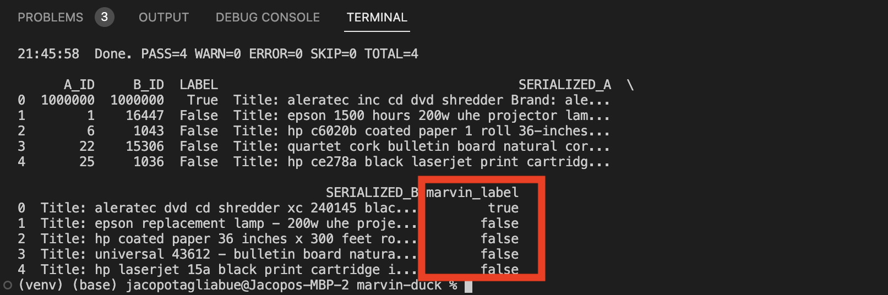

# Foundation Models for Entity Matching with marvin and duck db

## Overview

A poor man's entity resolution stack with LLMs, running on duckdb and marvin.

## Prerequisites

From the main project (refer to the main [instructions](https://github.com/jacopotagliabue/foundation-models-for-dbt-entity-matching/blob/main/README.md)):

* OpenAI API key;
* Python 3.9+ environment with `requirements.txt` (in this folder) installed;
* dbt [profile](https://docs.getdbt.com/docs/core/connection-profiles) named `duckdb-marvin` compatible with [duck-dbt](https://github.com/jwills/dbt-duckdb). Do not use an in-memory option, i.e. specify a local path (we suggest something like `/Users/jacopotagliabue/repos/foundation-models-for-dbt-entity-matching/src/marvin-duck/marvin.duckdb`, with `/Users/jacopotagliabue/repos/` replaced by your local path storing this repo).

## Run entity matching

* Make sure your Python virtualenv is active, and that an env variable named `MARVIN_OPENAI_API_KEY` contains your API key from OpenAI [ note: you can check your marvin setup by running first `python marvin_playground.py` ];
* cd into `dbt` and run `dbt seed` to get the dataset in the db.

Once that completed successfully, you can run a marvin-based entity pipeline over the dataset:

* `cd ..` to move out of the `dbt` folder;
* run `python marvin_entity_resolution.py` to run (through `dbt run`) the SQL pre-processing, and then print out the final table (with predictions) as a pandas dataframe [ note that the test script has few variables to change, in case your local path or dbt models have been named differently! ]

If all goes well, you should see a new dataframe containing, for each row, a Walmart product description, an Amazon product description, and a marving-generated inference for their match:

## FAQs

* Why not using marvin inside a dbt model? That was my first attempt as well, but unfortunately there seems to be something in the event loop at the heart of marvin that does not play nicely with how Python models are run in [dbt-duckdb](https://github.com/jwills/dbt-duckdb). It is possible that other ways of running Python models can provide a more general support!